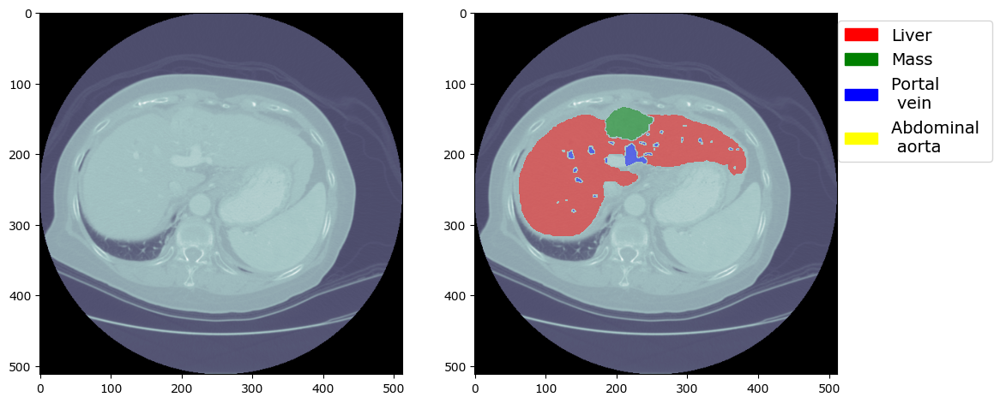

# Hepatocellular carcinoma Computer Vision Project

## Context

Hepatocellular carcinoma (HCC) being the most common liver cancer, with more than 40.000 cases in the United States in 2020. With a growing number of diagnosed cases, optimizing the evaluation of treatment effects on the tumor size can be a key driver in accelerating this task for radiologist. In this case, the work presented aims to estimate the effects of transarterial chemoembolization (TACE), which delivers chemotherapy to targeted liver tumors. Even though TACE is the most common treatment, up to 60\% of patients do not benetif from it, highlighting the importance of knowing the effect it is having in the patient. 

## Dataset

In this work, the HCC-TACE collection presented in the paper [HCC-TACE-Seg | Multimodality annotated HCC cases with and without advanced imaging segmentation](https://www.ncbi.nlm.nih.gov/pmc/articles/PMC9849450/) is used. The dataset contains a collection of 105 patients with HCC who were treated with TACE at The University of Texas MD Anderson Cancer Center between 1997 and 2012. The dataset contains computer tomography scans from both pre-treatment and post-treatment, containing a segmentation for the cancerous mass.

Data is obtained through The Cancer Imaging Archive ([TCIA](https://www.cancerimagingarchive.net/collection/hcc-tace-seg/))  which contains numerous datasets for different types of cancer. The dataset has to be downloaded through the NBIA Data Retriever, and contains 51,968 images in DICOM format and has a size of 28.57 GB. The CT scans can be visualized online through the National Cancer Institute ([NCI](https://portal.imaging.datacommons.cancer.gov/explore/)) searching for the HCC-TACE dataset. For example, a sample of the image of a section from the pre-treatment scan for patient number 26 in the database, without and with the masks in the segmentation. 

The computer tomography scans contain several sections of the patient's body, so the ones showing the cancerous mass have to be searched among all of the images in each series, which will contain a quantity of images ranging from 30 to 100 separate sections. As the files are in DICOM format, the first step taken is to store the pixel arrays and the segmentation masks sepparately to quicken the load time and work faster with the data. Still, given the size of the dataset, the reslulting files are of a size of about 5GB each, so they are not included in the repository. Instead, a sample of 3 patients is included (2, 26, 101).

## Approach

At first, the idea was to write an algorithm common to be able to segment the tumor on the post-treatment CT scan, to be able to measure the progression of the patient. This was soon met to be a hard task so one method is presented, showing good performance on the sample used to develop it, but it is clearly not robust as shown at the end. 

The structure followed is the following:

1. Find the section in the pre-treatment scan where the tumor is more visible (higher pixel count) 
2. Image preprocessing
3. Search for closes section in post-TACE scan
4. Create a region of interest around the tumor 
5. Study region of interest aiming at segmenting the tumor
6. Comparing tumor size to measure size reduction 

This method is developed with a chosen sample, in this case, 26. 

### Section Matching

For the first step, the segmentation mask corresponding to the tumor with the highest pixel count is searched, and then the corresponding pre-treatment scan is searched with a UID code. 

The next step is to find a section in the post-treatment scan at ideally the same section in the body of the patient, but realistically in the closest match. The method used was Structural Similarity Index Measure (SSIM), which accounts for texture as well as pixel difference. 

A very clear example from the [scikit-image documentation](https://scikit-image.org/docs/stable/auto_examples/transform/plot_ssim.html) is shown above, where MSE is equal in both modified images but SSIM is notably higher for the second. As example from the HCC-TACE database, the closest image found for the section with most tumor visible is shown below. 

The section is not exactly the same, but they are not far from each other and so cosidered as valid for the work done further. Also, in the post-treatment the tumor can be seen more clearly, which will help for the next steps. 

### Region of interest

Once the closest image has been found for every sample, the next step is to determine a region of interest. For this, given the tumor contour, a box around it giving some margins to account for factors like change of position between scans or tumor growth. This selection of a smaller area is aimed making the following segmentation easier. 

### Tumor segmentation and comparison

Once a window is created for the last scan, the next objective is to segment the tumor to be able to compare against the pre-treatment size. 
Following this patient's scan, it is clear that the tumor has a different texture than the rest of the body. The approach taken is to use an edge detector to capture this difference, in this case the Canny edge detector. The objective is to then search the an area with more concentrated edges, this will limit the performance in cases in which the tumor appears to have a smooth texture in the scans. The results for the chosen patient can be seen below. 

Once the edges are generated, they are dilated in order to group them for later finding the maximum contour. Once the contour has been found we have a segmentation for the tumor in the post scan, and we can compare how it has changed after treating the patient. Below is the results for the chosen patient, which according to the presented method resulted in a 42% size reduction in the tumor mass. 

### Conclusion

The presented method is based solely on one sample so, as expected, it is not robust when working with other patients. As only one factor has been considered when segmenting the tumor in the post-treatment scan, performance is highly dependant in this. As example of a patient on a non performing case, below is the result for patient 101. In this case the tumor shows a smooth texture in the scan, so other methods would be needed to successfully segment it. 

